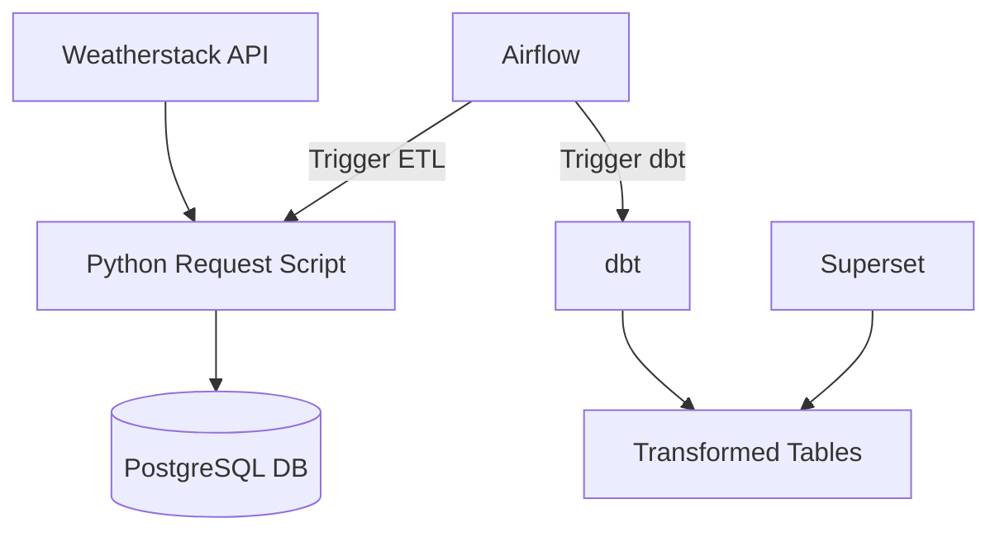

# 🌦️ Real-time Weather Data Pipeline Project

This project demonstrates a complete **data pipeline** using:
- ⛅ Weatherstack API
- 🐘 PostgreSQL
- 🛠️ Apache Airflow
- 📊 dbt (data build tool)
- 📈 Apache Superset

It ingests weather data from a public API, transforms it using `dbt`, orchestrates tasks with `Airflow`, and visualizes results in `Superset`.

---

## 🧱 Architecture Overview



🗂️ Project Structure
```
├── airflow/
│   └── dags/               # DAGs for ingestion and dbt
├── api-request/            # Python script to pull data from API
├── dbt/
│   └── my_project/         # dbt models & configs
├── docker/                 # Superset configs
├── postgres/               # SQL init scripts
├── docker-compose.yml      # All-in-one setup
├── .env                    # Environment variables
└── README.md               # Project documentation
```

🚀 Features
⛅ Weather API: fetch real-time temperature, humidity, wind speed

🐘 PostgreSQL: store raw and transformed data

🛠 Airflow: automate API ingestion & dbt transformation

🔧 dbt: create analytics models using SQL

📊 Superset: build dashboard visualizing weather trends

⚙️ Setup Instructions
1. Clone the repo
```
git clone https://github.com/DiuNH1710/weather-data-project.git
cd weather-data-project
```
2. Create .env file for Superset

3. Start all services with Docker Compose
```
docker compose up -d --build
```

4. Run Airflow dags manually or wait for schedule
Visit:

Airflow: http://localhost:8000

Superset: http://localhost:8088

DB: localhost:5000 (PostgreSQL)

📊 Superset Dashboard Example
You can visualize:

Average temperature over time

Humidity levels per day

Wind speed variations


📆 DAG Flow
weather_ingestion_dag: pulls weather data from API → PostgreSQL

dbt_transformation_dag: triggers dbt run to transform data

💡 Improvements
Schedule ingestion every 1 hour

Add anomaly detection on temperature spikes

Use Airflow sensors for API availability

